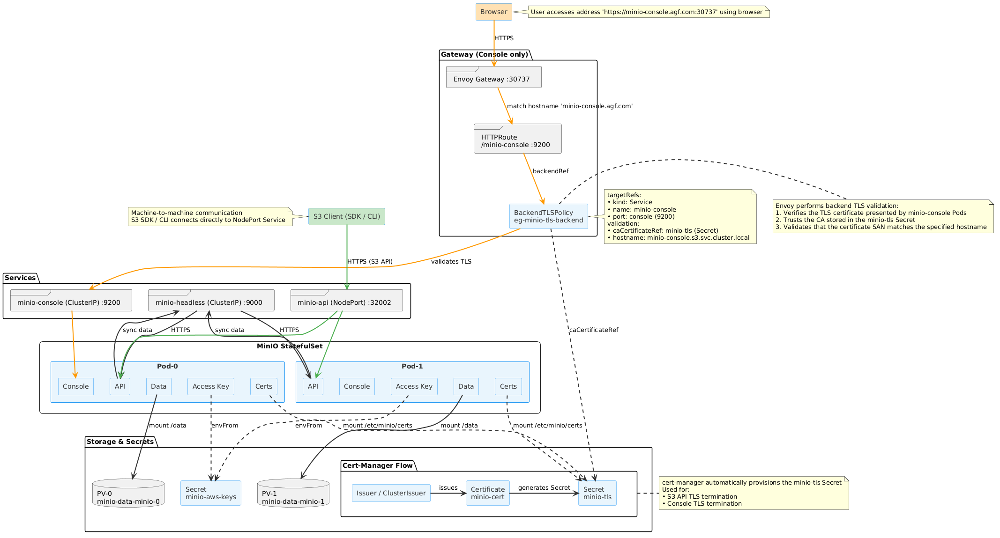

# minio
This project is about the use and configuration of the minio.

## Install minio with Helm
### Deploy

#### 1. Fetch the helm chart
```console
git clone https://github.com/akley-MK4/minio.git
```

#### 2. Install
```console
cd ./minio/minio
helm install minio ./ -n s3
```

### Flow
